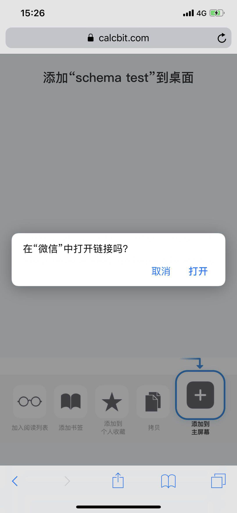

## ios app内页面添加到桌面
`2019-04-18`

#### 原理
- 准备好一个html页面，配置icon等等，并加上 `window.location.href="weixin://xxxx"`(这里以微信为例，xxx代表需要传的参数)，具体schema跳转的规则可查阅相关文档，这里不累述
- iOS 里 `[[UIApplication sharedApplication] openURL:[NSURL URLWithString:@"http//:xxxx"]];` 这里的 xxxx 是第一步准备好的html页面
- html 里引导用户将当前网页添加至桌面
- 用户点击新添加的标签就可以通过 schema 唤起 app 了

<big style="color:red">**However 真要是这么简单我就不写这篇博了**</big>

### 上述方法存在的问题
- app 唤起 safari 打开这个地址时就会弹出提示 `在 xx 中打开链接吗` 的系统弹窗提示。
- 每次打开桌面上的标签就会弹出同样的提示
- 

### 需求
- app 打开 Safari 时不尝试唤起app
- 从桌面标签点开始直接唤起app，不弹出提示弹窗

### 解决方案

#### app 打开 Safari 时不尝试唤起app
- 给 html 加上 `<meta name="apple-mobile-web-app-capable" content="yes">` 要求全屏显示
- schema 跳转时加上 `if(window.navigator.standalone)` 判断是否全屏模式
- 因为app唤起safari打开时肯定不是全屏的，所以不会走进唤起schema的逻辑，而添加到桌面后打开则是全屏模式，就会走schema唤起app

#### schema 唤起 app 不显示确认弹窗
- 如果您按上面的流程走完了，会发现这时候从桌面打开标签会直接唤起app，没有弹出确认弹窗
- 对于这个偶然的发现，也是不知道究竟是什么原理。猜测有下原因：
    - meta 标签导致添加到桌面后，iOS默认是以pwa的模式打开了这个页面
    - 独立的PWA仍由奇怪的Web.app进程及其兄弟WebApp1.app提供支持。这意味着它不是100％Safari或SFViewController。[参考文章](https://medium.com/@firt/pwas-on-ios-12-2-beta-the-good-the-bad-and-the-not-sure-yet-if-good-a37b6fa6afbf)

### iOS 12.2 新问题
- 以上操作在12.2以前都是ok的，但是12.2从桌面打开，响应的js并不会执行一遍，也就是那段js逻辑根本没有执行，即使监听 `onpageshow`事件也不会执行
- 然后观摩了支付宝添加小程序到桌面的sao操作，直接是把html搞成base64 string 在Safari打开，用这个方式打开的页面保存桌面后，每次打开都会执行